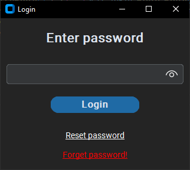

# CSE || Computer Secure Explorer

is a file explorer with high level **encryption** to protect your important files and directories,
protected with password to **prevent manipulation and increase integrity**
with normal options that any explorer have **(delete, copy, paste, rename, create)**,
implemented with powerful **UI** and support dark mode.

## Application

